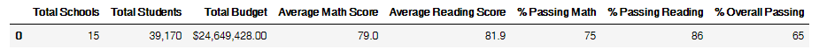
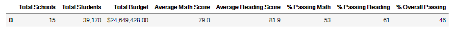
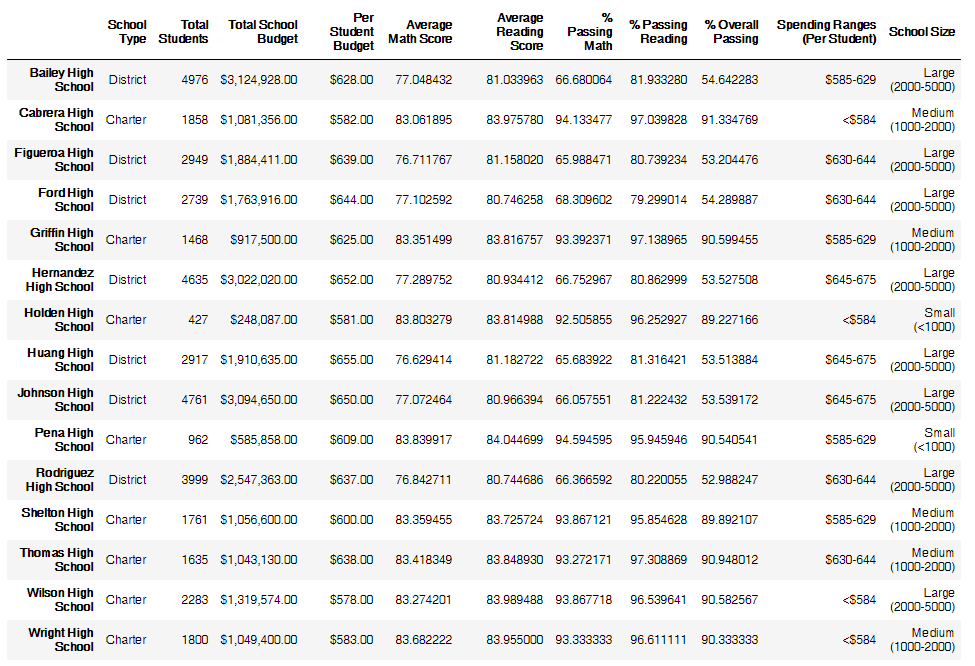
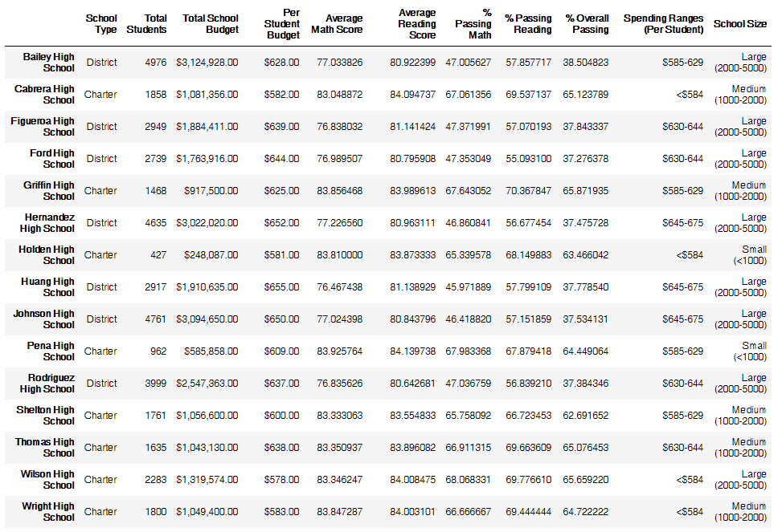

# Challenge - school-district-analysis
--
1.	How is the district summary affected?
--
The % Passing values have all declined. % Passing Math declined (22) points from 75 to 53. % Passing Reading declined (25) points from 86 to 61. % Overall Passing declined (19) points from 65 to 46. 

District Summary Module 

District Summary Challenge

--
2.	How is the school summary affected?
--
The % Passing values have all declined

School Summary Module

School Summary Challenge

--
3.	How does replacing the ninth graders’ math and reading scores affect Thomas High School’s performance, relative to the other schools?
--
Thomas High School went from being the second-best performing school to the fourth which may mean their ninth graders performed better than the ninth graders at other schools. 

Top Schools Module
 
Top School Challenge

--
4.	How does replacing the ninth-grade scores affect the following?
--
a.	Math and Reading Scores by Grade
--
Only the 9th grade scores show up as nan, no other grades were affected.

Math Scores by Grade Module
 
Math Scores by Grade Challenge
 
Reading Scores by Grade Module
 
Reading Scores by Grade Challenge

--
b.	Scores by School Spending
--
Average Math Score for the $585-629 spending range schools grew +0.1 percentage points and the $645-675 schools declined (-0.1) with all other school spending groups remaining the same. Average Reading Scores remained the same apart from the <$584 spending range of schools increased +0.1 percentage points. % Passing dropped overall.

Scores by School Spending Module
 
Scores by School Spending Challenge
 
c.	Scores by School Size

The Average Math Score grew +0.1 percentage points for both Small and Medium schools. The Average Reading Score grew +0.1 for Small schools. % Passing Math, % Passing Reading, and % Overall Passing all declined.  

Scores by School Size Module
 
Scores by School Size Challenge
 
d.	Scores by School Type

Charter Average Math Score increased +0.1 percentage points and Average Reading Score remained the same. District Average Math and Reading Scores both dropped (-0.1) percentage points. % Passing dropped for both Charter and District.

Scores by School Type Module
 
Scores by School Type Challenge
 
